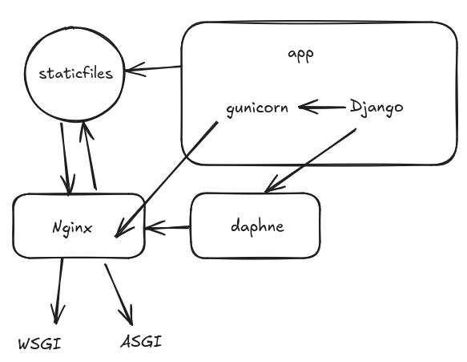

## Ambiente virtual

- Usado como ambiente de trabalho do projeto, onde as dependências do projeto serão instaladas de forma isolada não afetando outros projetos na máquina.

- as dependências do projeto podem ficar registradas no `requirements.txt` pois desta forma sempre que baixar o repositório para uma máquina pode realizar a a instalação das dependências a partir deste arquivo.

- Logo no início criei um `.gitignore` para evitar excessos nos commits e pushs

### Criando, ativando e desativando o ambiente virtual (windows)

```cmd
#cria
python -m venv <nome_ambiente>

#ativa
venv/Scripts/activate

#desativa
venv/Scripts/deactivate

```

### Criando, ativando e desativando o ambiente virtual (linux)

```bash
#cria
python -m venv <nome_ambiente>

#ativa
source venv/bin/activate

#desativa
deactivate

```

### Registrando dependências usadas no projeto.

```bash
#cria arquivo e salva o nome e versão das dependências usadas no projeto
pip freeze > requirements.txt
```

### Criando Projeto django

```bash
#instalar django no projeto
pip install django

#criar o projeto
django-admin startproject ft_transcendence

#iniciar o projeto (o terminal exibirá qual ip e porta o projeto está rodando)
cd ft_transcendence
python manage.py runserver
  
```

---

## Estrutura do Django
- O django usa Apps para separar os contextos, e cada contexto tem sua lógica de aplicação e negócio e no django cada contexto(ou domínio) é um app, e portanto foi criado uma pasta apps para conter todos os apps, sendo eles até o momento:

- **core**: Lida com a lógica do jogo e funcionalidades principais.
- **custom_auth**: Lida com autenticação de usuários na aplicação
- **users**: Gerencia usuários como cadastro, perfis e sistema de amigos.
- **match**: Representa uma partida e compõe o torneio
- **tournaments**: Para organização de torneios entre jogadores.
- **chat**: Fornece comunicação ao vivo entre amigos.

### Comandos para criar os apps
```bash
    python ../manage.py startapp core
    python ../manage.py startapp custom_auth
    python ../manage.py startapp users
    python ../manage.py startapp match
    python ../manage.py startapp tournaments
    python ../manage.py startapp chat

```

- O Django trabalha com arquitetura MVT (Model, View, Template), parecida com o que a web usa normalmente conhecido como MVC (Model, View, Controller), podemos considerar:
- **MVC**:
	- **Model**: Representa os dados e a lógica de negócio. É responsável por interagir com o banco de dados, validar dados e aplicar regras de negócios.
	- **View**: A parte da interface do usuário, o que o usuário vê e com o que interage (HTML, CSS, etc.).
	- **Controller**: Atua como o intermediário entre o Model e a View. Ele recebe entradas do usuário, chama o Model para manipular os dados e seleciona qual View apresentar ao usuário com base no resultado.
  
- **MVT**:
	- **Model**: Semelhante ao do MVC, o Model no Django também é responsável pela lógica de negócio e interação com o banco de dados.
	- **View**: Diferente do conceito de View no MVC, no Django, a View lida com a lógica de controle (equivalente ao Controller do MVC). Ela processa requisições, interage com o Model e decide qual Template renderizar.
	- **Template**: A camada de apresentação, responsável por gerar o HTML e o que o usuário vê. Isso corresponde à View no MVC.
  
- **Resumo**:
	- **MVC** Model = **MVT** Model
	- **MVC** View = **MVT** Template
	- **MVC** Controller = **MVT** VIew

-  **Outros**:
	- Os conceitos expressos expressos acima podem ser desmembrados em outras camadas como:
		- **Service ou business**: as Models representam apenas as entidades e podem ser mapeadas pelo banco de dados e as regras de negócio ficam nesta nova camada.
		- **Dao ou Repository**: Neste ponto ficam os métodos que constroem as querys e realizam acesso aos dados no banco de dados.
		- ***os diretórios business e repository não foram usados neste projeto.**

- **Estrutura de diretórios:**

```bash
#Estrutura do projeto ft_transcendence
├───apps    # Diretório principal para todos os aplicativos Django do projeto    
│   ├───chat   # Aplicativo para funcionalidades relacionadas a chat   
│   │   ├───__init__.py # Inicializa o pacote Python do aplicativo
│   │   ├───admin.py   # Configurações do admin do Django para o aplicativo
│   │   ├───apps.py    # Config do aplicativo (registro, config adicionais)
│   │   ├───migrations # Migrações de banco de dados 
│   │   │   └───__init__.py # Inicializa o pacote Python das migrações
│   │   ├───models.py # Define os modelos de dados do aplicativo
│   │   ├───static     # Arquivos estáticos   
│   │   ├───templates  # Templates para reúso    
│   │   ├───tests.py   # Testes unitários para o aplicativo
│   │   ├───views.py   # Define as views e lógica das solicitações do aplicativo
│   ├───common_templates          
│   ├───core   # Aplicativo central com funcionalidades do game
│   │   ├───__init__.py 
│   │   ├───admin.py   
│   │   ├───apps.py    
│   │   ├───migrations
│   │   │   └───__init__.py 
│   │   ├───models.py 
│   │   ├───static      
│   │   ├───templates     
│   │   ├───tests.py   
│   │   ├───views.py     
│   ├───custom_auth   # Aplicativo para autenticação personalizada            
│   │   ├───__init__.py 
│   │   ├───admin.py   
│   │   ├───apps.py    
│   │   ├───migrations 
│   │   │   └───__init__.py 
│   │   ├───models.py 
│   │   ├───static     
│   │   ├───templates  
│   │   ├───tests.py 
│   │   ├───views.py          
│   ├───match    # Aplicativo para funcionalidades das partidas      
│   │   ├───__init__.py
│   │   ├───admin.py  
│   │   ├───apps.py   
│   │   ├───migrations
│   │   │   └───__init__.py
│   │   ├───models.py 
│   │   ├───static     
│   │   ├───templates  
│   │   ├───tests.py  
│   │   ├───views.py              
│   ├───static                    
│   │   ├───assets  # Fontes, ícones e outros arquivos de recurso              
│   │   ├───css                   
│   │   │   └───bootstrap         
│   │   │       ├───mixins        
│   │   │       └───utilities     
│   │   └───js                    
│   ├───tournaments   # Aplicativo para funcionalidades relacionadas a torneios    
│   │   ├───__init__.py 
│   │   ├───admin.py   
│   │   ├───apps.py    
│   │   ├───migrations 
│   │   │   └───__init__.py 
│   │   ├───models.py 
│   │   ├───static     
│   │   ├───templates     
│   │   ├───tests.py   
│   │   ├───views.py             
│   └───users        # Aplicativo para funcionalidades relacionadas a usuários   
│   │   ├───__init__.py 
│   │   ├───admin.py  
│   │   ├───apps.py   
│   │   ├───migrations
│   │   │   └───__init__.py 
│   │   ├───models.py 
│   │   ├───static     
│   │   ├───templates    
│   │   ├───tests.py   
│   │   ├───views.py            
└───ft_transcendence # Diretório principal do projeto
│   ├───__init__.py  # Arquivo de inicialização do pacote Django
│   ├───asgi.py      # Configuração do ASGI (Asynchronous Server Gateway Interface)
│   ├───settings.py  # Arquivo de configuração do Django
│   ├───urls.py      # Arquivo de roteamento de URLs do Django
└───└───wsgi.py      # Configuração do WSGI (Web Server Gateway Interface)

```

Os Apps precisam ser registrados para serem reconhecidos:
No arquivo  `settings.py` foram registrados da seguinte forma:

```python

# Application definition
INSTALLED_APPS = [
    'django.contrib.admin',
    'django.contrib.auth',
    'django.contrib.contenttypes',
    'django.contrib.sessions',
    'django.contrib.messages',
    'django.contrib.staticfiles',
    'apps.custom_auth',           #adicionado
    'apps.chat',                  #adicionado
    'apps.core',                  #adicionado
    'apps.match',                 #adicionado
    'apps.tournaments',           #adicionado
    'apps.users'                  #adicionado
]
```

---
## Setup do Front-End
Para o Front-end usaremos uma abordagem de templates onde teremos uma base que poderá ser reaproveitada e templates de cada app que serão inseridos cada um no seu respectivo momento de acordo com a lógica de negócio implementada.

Para realizar o setup:
- Foram criados diretórios(como pode ser visto anteriormente na árvore)
  - **static** (no diretório apps) este irá conter os arquivos estáticos que podem ser acessados por qualquer app.
  - **common_templates** (no diretório apps) este irá conter os templates base que podem ser reutilizados evitando repetição de código (DRY).
  - **static** e **templates** (no diretório de cada app) estes irão conter cada um em seu app seus templates e arquivos estáticos isolando assim contextos.
- Os diretórios foram registrados no `settings.py` para que o Django possa mapear os arquivos.

```python

"""
Configuração dos paths dos templates da aplicação
"""
TEMPLATES = [

    {
        'BACKEND': 'django.template.backends.django.DjangoTemplates',
        'DIRS': [
            BASE_DIR / 'apps' / 'common_templates',             # Diretório para templates base
            BASE_DIR / 'apps' / 'chat' / 'templates',           # Templates do chat
            BASE_DIR / 'apps' / 'core' / 'templates',           # Templates do core
            BASE_DIR / 'apps' / 'custom_auth' / 'templates',    # Templates do custom_auth
            BASE_DIR / 'apps' / 'match' / 'templates',          # Templates do match
            BASE_DIR / 'apps' / 'tournaments' / 'templates',    # Templates do tournaments
            BASE_DIR / 'apps' / 'users' / 'templates',          # Templates do users
        ],
        'APP_DIRS': True,      # Permite mapeamento de diretórios dos apps
        'OPTIONS': {
            'context_processors': [
                'django.template.context_processors.debug',
                'django.template.context_processors.request',
                'django.contrib.auth.context_processors.auth',
                'django.contrib.messages.context_processors.messages',
            ],
        },
    },
]


"""
Configuração dos paths dos diretórios de arquivos estáticos da aplicação
"""
# Static files (CSS, JavaScript, Images)
# https://docs.djangoproject.com/en/5.1/howto/static-files/
STATIC_URL = '/static/'

# Diretório para arquivos estáticos comuns (CSS, JS globais, etc.)
STATICFILES_DIRS = [
    BASE_DIR / 'apps' / 'static',                 # Static base para todos os apps
    BASE_DIR / 'apps' / 'chat' / 'static',         # Static do chat
    BASE_DIR / 'apps' / 'core' / 'static',         # Static do core
    BASE_DIR / 'apps' / 'custom_auth' / 'static',  # Static do custom_auth
    BASE_DIR / 'apps' / 'match' / 'static',        # Static do match
    BASE_DIR / 'apps' / 'tournaments' / 'static',  # Static do tournaments
    BASE_DIR / 'apps' / 'users' / 'static',        # Static do users
]
  
# Diretório para arquivos estáticos após o collectstatic
STATIC_ROOT = BASE_DIR / 'staticfiles'

```

- Uma tela foi configurada para testar o setup e dar início a construção do projeto:
  - **App**: **custom_auth** : responsável pelas regras de autenticação e registro.
  - **tela**: **signin**: tela de login da aplicação que será invocada na rota raiz
    - Para configuração foi necessário:
 		- registrar a rota no arquivo `urls.py` para que  seja possível acessar uma rota pela url e se direcionado para a tela de login usando os templates.
 		- Criação de classe no arquivo `views.py` customizando a interpretação do acesso a rota especificada (como um controller sendo chamado ao acessar uma rota)
 		- definição de Name do aplicativo personalizado no arquivo `apps.py` para que o framework reconheça o aplicativo corretamente disponibilizando-o em toda aplicação de acordo com a configuração realizada em `settings.py` no "INSTALED_APPS".

```python

"""
registrando a rota chamando o controller(view) no urls.py
"""
from django.urls import path

#registrando as views
from apps.custom_auth.views import CustomLoginView

urlpatterns = [
    path('', CustomLoginView.as_view(), name='signin'),     #rota da tela de login (raiz)
]


"""
definindo o nome do template a ser renderizado ao acessar a rota raiz chamando este controller(view) no arquivo views.py
"""
from django.contrib.auth.views import LoginView

class CustomLoginView(LoginView):
    template_name = 'signin.html'


"""
definindo o name do app em apps.py para que ele seja reconhecido em toda aplicação assim como foi "instalado" lá em settings.py
"""
from django.apps import AppConfig

class CustomAuthConfig(AppConfig):
    name = 'apps.custom_auth'


```

Feito as configurações acima foi realizado a inserção dos arquivos de Front-End nas pastas devidas e realizado configuração de tags para uso e interpretação de dados pelo django, as tags são:
- **** Carrega o template tag `static` do Django, permitindo o uso de URLs para arquivos estáticos (CSS, JavaScript, imagens) no template.
- **** Define um bloco de conteúdo que pode ser substituído em templates filhos que estendem o template atual.
- **** Define um bloco de conteúdo que pode ser substituído em templates filhos.
- **** Define um bloco de conteúdo para CSS adicional que pode ser incluído em templates filhos.
- **** Define um bloco de conteúdo para JavaScript adicional que pode ser incluído em templates filhos.
- **** Especifica que o template atual herda de um template base.
- **** Insere um token CSRF (Cross-Site Request Forgery) em um formulário para proteger contra ataques CSRF.
- action="****"  Usado para especificar de forma explícita a rota a qual o form irá submeter a requisição


Obs.: mais tags serão usadas ao decorrer da criação da aplicação e esta lista será atualizada.
Obs².: para finalizar o setup do front será realizado o uso de arquivos chave valor para idiomas. (em construção)...

---

## Setup do banco de dados

Para realizar o setup do banco de dados no Django, é necessário adicionar no settings.py os bancos que serão conectados e os dados de acesso.
Nesse caso em especifico, os dados de acesso estão sendo pegos de um arquivo .env que é passado para o django na criação do container docker.
É necessário fazer a instalação da dependencia que faz a conexão com o banco através do pip, além de configuar ela no parâmetro engine.
No caso do projeto em específico está sendo usado psycopg e psycopg-binary para se conectar ao POSTGRES.

```python
DATABASES = {
    'default': {
        'ENGINE': os.getenv('DB_ENGINE', 'django.db.backends.sqlite3'),
        'NAME': os.getenv('POSTGRES_DB', BASE_DIR / 'db.sqlite3'),
        'USER': os.getenv('POSTGRES_USER', ''),
        'PASSWORD': os.getenv('POSTGRES_PASSWORD', ''),
        'HOST': os.getenv('POSTGRES_HOST', ''),
        'PORT': os.getenv('POSTGRES_PORT', ''),
    }
}
```

## Setup do docker

A partir do momento que o projeto estiver configurado, vamos criar uma imagem docker e colocar iniciar outras imagens para auxiliar o sistema.

# Instalação do Docker

Este guia explica como instalar o Docker Engine no Ubuntu.

## 1. Pré-requisitos

Antes de instalar o Docker, considere as seguintes implicações de segurança e limitações de firewall:

- Ao expor portas de contêineres usando Docker, essas portas podem ignorar as regras de firewall configuradas com `ufw` ou `firewalld`.
- Docker é compatível apenas com `iptables-nft` e `iptables-legacy`. Certifique-se de que qualquer regra de firewall seja criada com `iptables` ou `ip6tables`, e adicione-as à cadeia `DOCKER-USER`.

## 2. Requisitos de Sistema Operacional

Docker Engine pode ser instalado nas seguintes versões de Ubuntu (64-bit):

- Ubuntu Noble 24.04 (LTS)
- Ubuntu Jammy 22.04 (LTS)
- Ubuntu Focal 20.04 (LTS)

Arquiteturas suportadas: `x86_64` (amd64), `armhf`, `arm64`, `s390x`, e `ppc64le`.

## 3. Desinstalar versões antigas

Antes de instalar o Docker, remova qualquer pacote que possa gerar conflitos com a versão oficial:

```bash
for pkg in docker.io docker-doc docker-compose docker-compose-v2 podman-docker containerd runc; do sudo apt-get remove $pkg; done
```

Nota: Imagens, contêineres, volumes e redes armazenados em /var/lib/docker/ não são removidos automaticamente ao desinstalar o Docker. Caso queira uma instalação limpa, siga as instruções da seção de desinstalação completa.

## 4. Instalar via repositório apt
Passo 1: Configurar o repositório apt do Docker
Atualize os pacotes e instale as dependências:

```bash
sudo apt-get update
sudo apt-get install ca-certificates curl
```

Adicione a chave GPG oficial do Docker:
```bash
sudo install -m 0755 -d /etc/apt/keyrings
sudo curl -fsSL https://download.docker.com/linux/ubuntu/gpg -o /etc/apt/keyrings/docker.asc
sudo chmod a+r /etc/apt/keyrings/docker.asc
```

Adicione o repositório Docker às fontes apt:

```bash
echo \
"deb [arch=$(dpkg --print-architecture) signed-by=/etc/apt/keyrings/docker.asc] https://download.docker.com/linux/ubuntu \
$(. /etc/os-release && echo "$VERSION_CODENAME") stable" | \
sudo tee /etc/apt/sources.list.d/docker.list > /dev/null
```

Atualize novamente os pacotes:

```bash
Copiar código
sudo apt-get update
```

Passo 2: Instalar os pacotes Docker
Para instalar a versão mais recente:

```bash
sudo apt-get install docker-ce docker-ce-cli containerd.io docker-buildx-plugin docker-compose-plugin
```

Passo 3: Verificar a instalação
Execute o seguinte comando para testar se o Docker está instalado corretamente:

```bash
sudo docker run hello-world
```

Se tudo estiver correto, você verá uma mensagem de confirmação indicando que o Docker está funcionando corretamente.

## 6. Configurar permissões pós-instalação

Se você não quiser usar `sudo` em cada comando Docker, siga os passos abaixo para configurar as permissões adequadas:

1. Crie o grupo `docker` (caso ele ainda não exista):

```bash
sudo groupadd docker
```   

Adicione o seu usuário ao grupo docker:

```bash
sudo usermod -aG docker $USER
```

Faça logout e login novamente, ou reinicie a máquina para que as mudanças tenham efeito.

Verifique se agora você pode rodar comandos Docker sem sudo:

```bash
docker run hello-world
```

Se tudo estiver correto, o comando deve rodar sem a necessidade de sudo.


## Docker Compose

Este projeto utiliza o Docker Compose para orquestrar múltiplos serviços necessários para a aplicação `ft_transcendence`. Abaixo estão os serviços configurados:

### 1. `app`
Este é o serviço principal da aplicação.

- **Build**: O contêiner é construído a partir do Dockerfile no diretório atual (`.`).
- **Ports**: O serviço mapeia a porta `8000` do contêiner para a porta `8000` do host.
- **Volumes**: O diretório local `./ft_transcendence` é montado no contêiner em `/ft_transcendence`, permitindo persistir dados e facilitar o desenvolvimento.
- **Variáveis de ambiente**: As variáveis são carregadas a partir do arquivo `.env` localizado em `./dotenv_files/.env`.
- **Dependências**: Este serviço depende do banco de dados Postgres (`postgres`) para ser iniciado.
- **Network**: O serviço está conectado à rede Docker `transcendence`.

### 2. `postgres`
Este serviço fornece o banco de dados PostgreSQL.

- **Image**: A imagem utilizada é `postgres:16.4-alpine3.20`, uma versão leve e estável do Postgres.
- **Volumes**: Os dados do Postgres são persistidos no diretório local `/home/${USER}/data/postgres`, que é montado como `/var/lib/postgresql/data/` no contêiner.
- **Ports**: O Postgres está acessível na porta `5432`, mapeada para a porta `5432` do host.
- **Variáveis de ambiente**: As variáveis são carregadas do mesmo arquivo `.env` utilizado no serviço `ft_transcendence`.
- **Network**: Conectado à rede `transcendence`.

### 3. `pgadmin`
O `pgAdmin` é uma interface web para gerenciar o banco de dados PostgreSQL.

- **Image**: Utiliza a imagem `dpage/pgadmin4`.
- **Ports**: A interface do `pgAdmin` está disponível na porta `5050` do host, mapeada para a porta `80` do contêiner.
- **Variáveis de ambiente**: As variáveis de configuração também são carregadas a partir de `./dotenv_files/.env`.
- **Network**: Conectado à rede `transcendence`.

### 4. `grafana`
O `Grafana` é uma plataforma de visualização de métricas.

- **Image**: A imagem utilizada é `grafana/grafana:latest`.
- **Ports**: O Grafana está acessível na porta `3000` do host, mapeada para a porta `3000` do contêiner.
- **Volumes**: Os dados do Grafana são armazenados no diretório local `/home/${USER}/data/grafana`, montado em `/var/lib/grafana` no contêiner, garantindo persistência.
- **User**: O contêiner é executado com as permissões definidas por `$UID` e `$GID`, variáveis que podem ser configuradas no `.env`.
- **Network**: Conectado à rede `transcendence`.

### 5. `prometheus`
O `Prometheus` é uma ferramenta de monitoramento e alertas.

- **Image**: A imagem utilizada é `prom/prometheus`.
- **Volumes**: As configurações do Prometheus são montadas no diretório local `/home/${USER}/data/prometheus`, acessível dentro do contêiner em `/etc/prometheus/`.
- **Ports**: O Prometheus está acessível na porta `9090`, mapeada para a porta `9090` do host.
- **Network**: Conectado à rede `transcendence`.

### Redes e Volumes

- **Network `transcendence`**: Todos os serviços estão conectados à mesma rede Docker `transcendence` com driver `bridge`, permitindo que eles se comuniquem entre si.
- **Volumes**:

  - `app_vol`: Volume dedicado para os dados do app.
  - `static_vol`: Volume dedicado para os dados estáticos do app que serão servidos pelo nginx.
  - `postgres_vol`: Volume dedicado para os dados do PostgreSQL.
  - `grafana_vol`: Volume dedicado para os dados do Grafana.
  - `prometheus_vol`: Volume dedicado para as configurações do Prometheus.

Este arquivo Docker Compose facilita o desenvolvimento e a configuração de um ambiente de execução completo para a aplicação `ft_transcendence`, integrando o banco de dados PostgreSQL, uma interface de gerenciamento com pgAdmin, além de ferramentas de monitoramento como Grafana e Prometheus.

# Prometheus e Grafana

Para integrar o Prometheus ao Django e expor as métricas da aplicação, você pode seguir estes passos, que incluem a instalação de pacotes e a configuração necessária no Django para que o Prometheus colete as métricas. Veja o passo a passo:

## Configurando o Django para utilizar o Prometheus luciano

Aqui está o passo a passo atualizado para configurar o Prometheus e o Grafana, incluindo as configurações necessárias no Django para expor métricas:


## Configurando o Prometheus e Grafana para monitorar a aplicação

### 1. Configuração do Prometheus

O Prometheus é responsável por coletar métricas da sua aplicação. Para configurá-lo, siga os passos abaixo:

#### Passo 1: Criar o arquivo de configuração do Prometheus

1. Crie um arquivo de configuração chamado `prometheus.yml` no diretório `./prometheus/`. Este arquivo vai dizer ao Prometheus onde coletar as métricas.

   Exemplo de arquivo `prometheus.yml`:

   ```yaml
   global:
     scrape_interval: 15s  # Intervalo de coleta das métricas

   scrape_configs:
     - job_name: 'transcendence'
       static_configs:
         - targets: ['transcendence:8000']  # Nome do serviço e porta onde as métricas serão expostas
   ```

2. Certifique-se de que o diretório `./prometheus/` está devidamente montado no contêiner do Prometheus no arquivo `docker-compose.yml`:

   ```yaml
   prometheus:
     image: prom/prometheus
     volumes:
       - ./prometheus/:/etc/prometheus/  # Mapeando o diretório de configuração
     ports:
       - "9090:9090"
     networks:
       - transcendence
   ```

3. Reinicie os contêineres para aplicar a configuração:

   ```bash
   make down && make (opt)
   ```

#### Passo 2: Acessar a interface do Prometheus

1. Abra o navegador e vá até `http://localhost:9090`. Esta é a interface do Prometheus.

2. Verifique se o Prometheus está coletando métricas corretamente clicando em **Status** > **Targets**. Você deverá ver o serviço `ft_transcendence` como um alvo sendo coletado.

### 2. Configuração do Grafana

O Grafana será usado para visualizar os dados coletados pelo Prometheus. Siga os passos abaixo para configurar.

#### Passo 1: Acessar o Grafana

1. Abra o navegador e vá até `http://localhost:3000`.

2. Faça login no Grafana. O login padrão é:

   - **Usuário**: `admin`
   - **Senha**: `admin`

   Você será solicitado a mudar a senha após o primeiro login.

#### Passo 2: Adicionar o Prometheus como Data Source

1. No menu lateral esquerdo, clique em **Configuration** (ícone de engrenagem) e selecione **Data Sources**.

2. Clique em **Add data source**.

3. Selecione **Prometheus**.

4. No campo **URL**, insira `http://prometheus:9090` (use o nome do serviço Prometheus do Docker Compose).

5. Clique em **Save & Test**. O Grafana verificará se consegue se conectar ao Prometheus.

#### Passo 3: Criar um Dashboard para visualizar as métricas

1. No menu lateral, clique em **Create** (ícone de “+”) e selecione **Dashboard**.

2. Clique em **Add new panel**.

3. No painel de edição:
   - Em **Query**, selecione o Data Source `Prometheus`.
   - No campo de **Métricas**, digite a métrica que você quer visualizar. Exemplo: `http_requests_total` ou outra métrica coletada pela sua aplicação.

4. Ajuste as configurações visuais e clique em **Apply**.

5. Repita o processo para adicionar mais painéis ao dashboard.

6. Após configurar os painéis, você pode salvar o dashboard clicando no ícone de disquete no topo da página e dando um nome ao seu dashboard.

OBS: Também é possível importar dashboards diretamente do site do Grafana https://grafana.com/grafana/dashboards/

### 3. Configuração no Django para expor métricas

Para que o Prometheus possa coletar métricas da sua aplicação Django, você precisa expor essas métricas. Siga os passos abaixo para configurar:

#### Passo 1: Instalar o pacote `django-prometheus`

1. Adicione o pacote `django-prometheus` às suas dependências no `requirements.txt` ou instale-o diretamente:

   ```bash
   pip install django-prometheus
   ```

#### Passo 2: Configurar o Django

1. Adicione `django_prometheus` à lista de `INSTALLED_APPS` no seu `settings.py`:

   ```python
   INSTALLED_APPS = [
       ...
       'django_prometheus',
       ...
   ]
   ```

2. Adicione o middleware `django_prometheus.middleware.PrometheusBeforeMiddleware` e `django_prometheus.middleware.PrometheusAfterMiddleware` ao seu `MIDDLEWARE` no `settings.py`:

   ```python
   MIDDLEWARE = [
       ...
       'django_prometheus.middleware.PrometheusBeforeMiddleware',
       ...
       'django_prometheus.middleware.PrometheusAfterMiddleware',
       ...
   ]
   ```

3. Adicione uma URL para expor as métricas no seu `urls.py`:

   ```python
   from django.urls import path
   from django_prometheus import exports

   urlpatterns = [
       ...
       path('metrics/', exports.ExportToDjangoPrometheus.as_view(), name='prometheus-metrics'),
       ...
   ]
   ```

#### Passo 3: Configurar o Prometheus para coletar métricas do Django

Certifique-se de que o Prometheus está configurado para coletar métricas do endpoint exposto pelo Django. No arquivo `prometheus.yml`, o `targets` deve apontar para o endpoint `/metrics/` da sua aplicação Django:

   ```yaml
   scrape_configs:
     - job_name: 'transcendence'
       static_configs:
         - targets: ['transcendence:8000']
   ```

### 4. Verificando a Integração

#### Verifique a Exposição de Métricas no Django

1. Abra o navegador e vá até o endpoint de métricas da sua aplicação Django: `http://localhost:8000/metrics`.
   - Se tudo estiver configurado corretamente, você verá uma lista de métricas no formato texto expostas pela aplicação.

#### Verifique a Coleta de Métricas no Prometheus

1. Acesse a interface do Prometheus em `http://localhost:9090`.

2. Vá até **Status** > **Targets**.
   - Você deverá ver o alvo da sua aplicação (`ft_transcendence`) na lista de *targets* que estão sendo monitorados. O estado deve ser "UP".

3. Para verificar se as métricas estão sendo coletadas corretamente, clique em **Graph** e digite o nome de uma métrica exposta pela sua aplicação, como `django_http_requests_total_by_method_total`.

4. Clique em **Execute** para visualizar os dados da métrica coletada pelo Prometheus.

#### Verifique a Exibição de Métricas no Grafana

1. Acesse o Grafana em `http://localhost:3000`.

2. No dashboard que você criou anteriormente, adicione novos painéis com as métricas expostas pelo Django. Algumas métricas comuns que o pacote `django-prometheus` fornece incluem:

   - `django_http_requests_total_by_method_total`: Número total de requisições HTTP, agrupadas por método (GET, POST, etc.).
   - `django_http_requests_latency_seconds_by_view`: Latência das requisições, agrupada pela *view* no Django.
   - `django_db_execute_total`: Total de execuções no banco de dados pelo Django.

3. Use o campo de busca de métricas no Grafana para encontrar as métricas que você configurou no Django e exiba essas informações nos painéis.

4. Após configurar os painéis, salve o dashboard para futuras visualizações.

### 5. Resolvendo Erros Comuns

- **Erro ao rodar comandos do Docker sem `sudo`:**
  Se você está recebendo erros ao rodar comandos Docker sem `sudo`, siga os passos de [Configuração pós-instalação do Docker](https://docs.docker.com/engine/install/linux-postinstall/) para adicionar seu usuário ao grupo `docker` e permitir executar comandos sem privilégios de superusuário.

- **Métricas não estão sendo coletadas pelo Prometheus:**
  Verifique se o endpoint `/metrics` da aplicação Django está acessível e se o Prometheus está configurado corretamente no arquivo `prometheus.yml`. Confira os logs do Prometheus para investigar possíveis problemas de conectividade ou erro de scrape.

- **Problemas de visualização no Grafana:**
  Certifique-se de que o Data Source do Prometheus foi configurado corretamente em `http://prometheus:9090` e que as métricas estão disponíveis no Prometheus antes de configurar os painéis no Grafana.

### 6. Atualizações Futuras e Melhorias

- **Adicionando alertas no Prometheus:**
  Considere configurar regras de alerta no Prometheus para receber notificações sobre problemas na aplicação, como alta latência ou número elevado de erros HTTP.

- **Monitoramento adicional:**
  Além das métricas básicas, você pode expor métricas personalizadas no Django para monitorar partes específicas da aplicação que são importantes para o seu projeto.

- **Integração com serviços de notificação:**
  Você pode integrar o Prometheus com o [Alertmanager](https://prometheus.io/docs/alerting/latest/alertmanager/) para enviar alertas via email, Slack ou outras plataformas quando certas condições forem atendidas.

### 7. Conclusão

Com o Prometheus e o Grafana configurados, você terá um sistema completo de monitoramento para sua aplicação Django. O Prometheus coleta métricas detalhadas e o Grafana permite criar dashboards personalizados para visualizar o desempenho e a saúde da aplicação. Seguindo este guia, você pode ajustar o monitoramento conforme as necessidades do seu projeto e adicionar novos alvos ou métricas personalizadas conforme o projeto evolui.

# DEVOPS

O projeto está estruturado da seguinte forma:



## Makefile features

```bash
make
   ```
   Inicia o projeto no modo de produção - todos os containers são criados no host.

```bash
make info
   ```
   Fornece o acesso, credenciais e testes para os serviços instalados.

```bash
make certs
   ```
   Monta os certificados ssl na pasta requirements.

```bash
make sudoers
   ```
   Adiciona permissões de usuário ao host.

```bash
make remove_sudoers
   ```
   Remove permissões de usuário do host.

```bash
make dev
   ```
   Inicia o projeto no modo de desenvolvimento - todos os containers são criados no host, exceto o container relativo à aplicação.

```bash
make win
   ```
   Inicia o projeto no modo de desenvolvimento para Windows- containers não possuem alias.

```bash
make service name=<service name>
   ```
   Apaga o container, volume, remonta a imagem relativa ao serviço.
   Serviços disponíveis:
   - app
   - postgres
   - pgadmin
   - grafana
   - prometheus
   - selenium
   - minio
   - nginx
   - daphne
